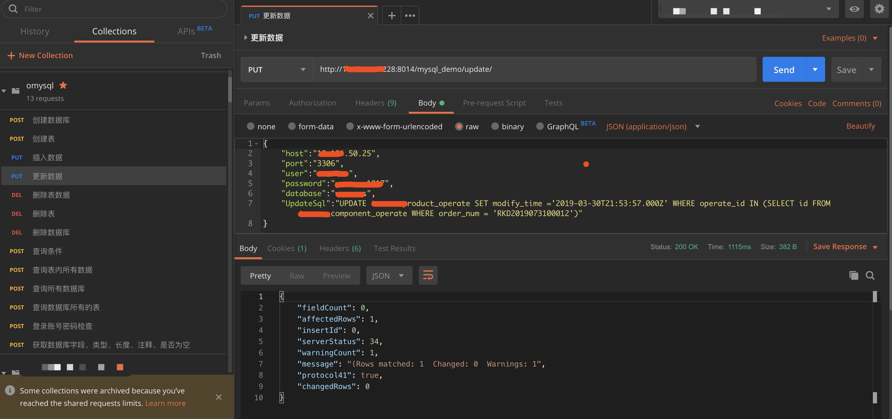

【服务诞生原因】目前团队测试、开发使用postman进行接口调试，但postman自身未提供操作数据库的功能，为方便测试人员使用postman，进行接口自动化测试时，可以直接请求操作数据库。网上使用比较多的是xmysql，但xmysql并不完美，当你在启用xmysql时，需要固定环境、账号、密码，特别是切换环境及其不方便，并且一旦接口地址外泄，对测试环境数据库有很大影响。由此诞生express-mysql-restfulAPI，我为其命名为omysql（o表示正确）

 

###使用方式

如果你电脑已经安装配置Git、node环境，可以直接按下面步骤进行操作：

1、从github拉取工程

```cmd
git clone git@github.com:liyinchigithub/express-mysql-restfulAPI.git
```

2、切换到目录下

```cmd
cd Omysql

```


3、安装依赖包

```
npm install

```


4、启动omysql服务

```
node server.js
```

5、如果你的电脑还没有node环境，具体配置方法可以参考下面两个链接：

windows
https://jingyan.baidu.com/article/1876c8529c79e2890b1376dd.html

mac
https://jingyan.baidu.com/article/6b1823098bdd9fba59e1597a.html


##API接口文档

###中文

1. 功能   创建数据库

请求方法：POST

请求地址：http://127.0.0.1:8004/mysql_demo/CreateDB/

请求body：

```cmd

{
	"host":"127.0.0.1",
	"user":"root",
	"password":"12345678",
	"port":"3306",
	"query":"CREATE DATABASE Express_API_DB;"
}

```
响应body：
```cmd
{
    "result": "success",
    "status": 200
}
```

2. 功能   创建表

请求方法：POST

请求地址：http://127.0.0.1:8004/mysql_demo/CreateTable/

请求body：

```cmd
{
	"host":"127.0.0.1",
	"user":"root",
	"password":"12345678",
	"port":"3306",
	"database":"数据库名称",
	"query":"CREATE TABLE table4(name VARCHAR(100),id VARCHAR(100),age INT,address VARCHAR(100),tel INT,PRIMARY KEY ( id ))ENGINE=InnoDB DEFAULT CHARSET=utf8;"
}
```

响应body：

```cmd
{
    "result": "success",
    "status": 200
}
```

3. 功能   插入数据

请求方法：PUT

请求地址：http://127.0.0.1:8004/mysql_demo/insert_data/

请求body：

```cmd
{
	"host":"127.0.0.1",
	"user":"root",
	"password":"12345678",
	"port":"3306",
	"database":"数据库名称",
	"addSql":"INSERT INTO table4(address,age,id,name,tel) VALUES('福建省泉州市丰泽区',19,225,'刘丽丽','159115');"
}
```

4. 功能   更新数据

请求方法：PUT

请求地址：http://127.0.0.1:8004/mysql_demo/update/

请求body：
```cmd
{
	"host":"127.0.0.1",
	"user":"root",
	"password":"12345678",
	"port":"3306",
	"database":"数据库名称",
	"UpdateSql":"UPDATE table4 SET address='福建省厦门市',age='17',id='123',name='赵柳',tel='123123' WHERE name='刘丽丽';"
}
```

5. 功能   删除表数据

请求方法：DELETE

请求地址：http://127.0.0.1:8004/mysql_demo/delete/

请求body：
```cmd
{
	"host":"127.0.0.1",
	"user":"root",
	"password":"12345678",
	"port":"3306",
	"database":"数据库名称",
	"delSql":"DELETE FROM table4 where name='王老五';"
}
```

6.功能   删除表

请求方法：DELETE

请求地址：http://127.0.0.1:8004/mysql_demo/drop

请求body：
```cmd
{
	"host":"127.0.0.1",
	"user":"root",
	"password":"12345678",
	"port":"3306",
	"database":"数据库名称",
	"DropSql":"DROP TABLE table4;"
}
```


7.功能   删除数据库

请求方法：DELETE

请求地址：http://127.0.0.1:8004/mysql_demo/drop

请求body：
```cmd
{
	"host":"127.0.0.1",
	"user":"root",
	"password":"12345678",
	"port":"3306",
	"database":"数据库名称",
	"DropSql":"DROP DATABASE Express_API_DB;"
}
```

8.功能   查询条件

请求方法：POST

请求地址：http://127.0.0.1:8004/mysql_demo/find

请求body：
```cmd
{
	"host":"127.0.0.1",
	"user":"root",
	"password":"12345678",
	"port":"3306",
	"database":"数据库名称",
	"findSql":"SELECT * FROM table4 WHERE name='赵柳';"
}
```

9.功能   查询表内所有数据

请求方法：POST

请求地址：http://127.0.0.1:8004/mysql_demo/find

请求body：
```cmd
{
	"host":"127.0.0.1",
	"user":"root",
	"password":"12345678",
	"port":"3306",
	"database":"数据库名称",
	"findSql":"SELECT * FROM table4;"
}
```

10.功能   查询所有数据库

请求方法：POST

请求地址：http://127.0.0.1:8004/mysql_demo/show_databases

请求body：
```cmd
{
	"host":"127.0.0.1",
	"port":"3306",
	"user":"root",
	"password":"12345678",
	"findSql":"show databases"
	
}
```

11.功能   查询数据库所有表

请求方法：POST

请求地址：http://127.0.0.1:8004/mysql_demo/show_databases

请求body：

```cmd
{
	"host":"127.0.0.1",
	"port":"3306",
	"user":"root",
	"password":"12345678",
	"database":"数据库名称",
	"findSql":"show tables"
}
```

